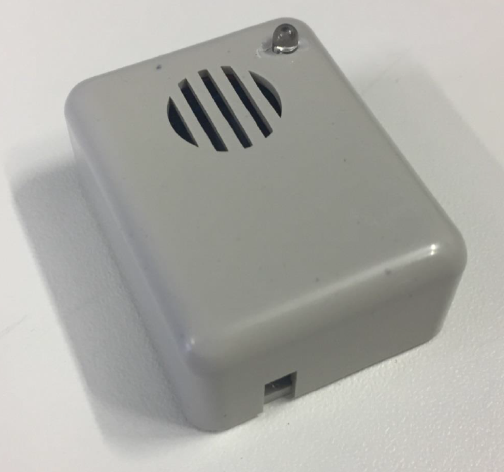

# Introduction

### New: Android App available
https://github.com/FROeHlyEisvogel/ClimaSens-Scanner/raw/master/Application/build/outputs/apk/debug/ClimaSensScanner-debug.apk

# Smart-ClimaSens

This document gives an overview about the Smart-ClimaSens project.

### Flexibility

The Smart-ClimaSens is based on a CC2541 - BLE-Controller.
The whole project is modular so you can use different sensors with the same module.
It will automatically detect the connected module and provide its data.

### Low-energy

Most of the time the BLE-Module is in sleep mode and wakes up every 20s to advertise data.
Each sensor has its own measure interval and is designed to reduce or avoid idle current.

### Long durability

The Smart-ClimaSens can run for about 5 years with only one CR2032 battery.

### Low-cost

There are a lot of things you don&#39;t have to build yourself because if you buy it, it will be much cheaper. But you will never find a sensor with the same features at a lower price than this.

### Easy to use

All you have to do to build this sensor is connecting modules together.
No programming knowledge, no electronic knowledge and no linux knowledge is needed.
Each step is describes in words, pictures or drawings if needed.

### Small size

As far as the battery is the biggest part of the whole device there is not much space left which can be optimized. It is possible to build all sensors and the BLE-module on only one circuit board but the complete modules are cheaper than the components itself.

### Compatibility

The whole project is open source so everyone can add a missing sensor, customize the software, report a bug or request a new feature.
Also BLE is a very common interface which is supported by a lot of devices or can be added by a Bluetooth dongle.

1. Required hardware

Control center:

- --Raspberry Pi 3 (not tested with others, Bluetooth required)

For programming:

- --Arduino Uno (or similar)

Smart-ClimaSens:

- --BLE-Module: JDY-08 with CC2541 Controller
- --Battery: CR2032 (3V)
- --Clima-Sensor: Si7021 or BME280 (does also measure pressure)
- --Optionally:
  - Light-Sensor: LED 3mm + 10nF capacitor
  - Magnet-Contact: Reed-Contact
